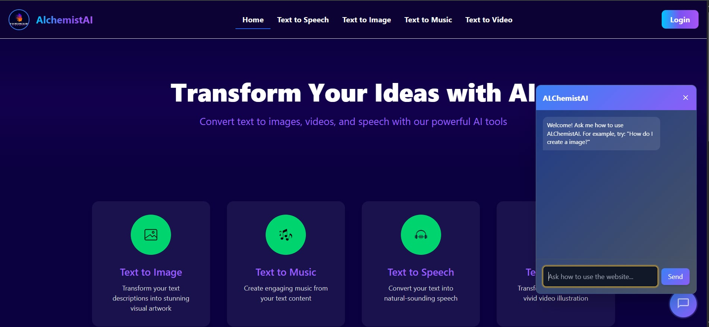
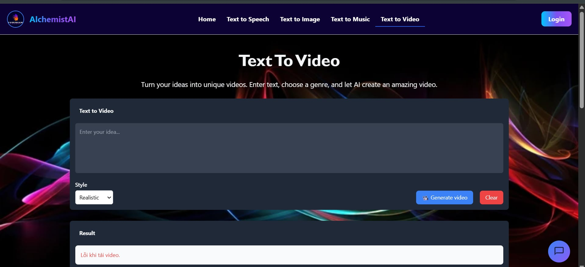
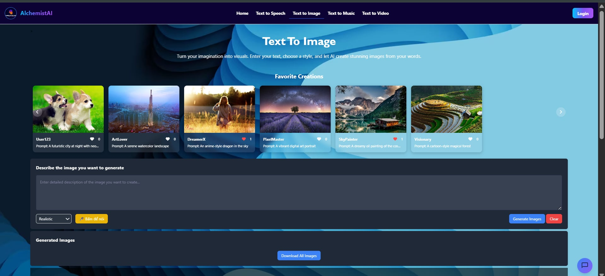
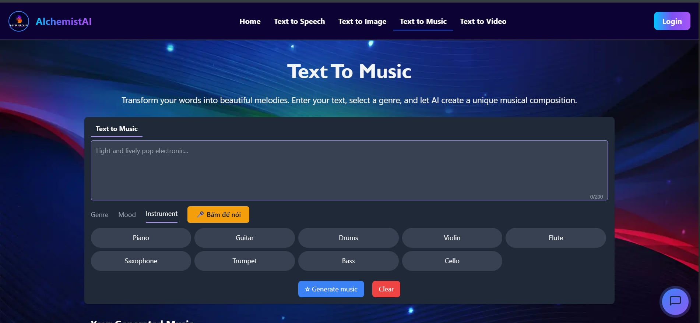

<a id="readme-top"></a>
<br />

<div align="center">
  <a href="https://github.com/nguyenvantrwng/DoAnWeb">
    
  </a>

  <h3 align="center">AIchemistAI</h3>

  <p align="center">
    AIchemistAI the all-in-one AI tool!
    <br />
    <a href="https://github.com/nguyenvantrwng/DoAnWeb"><strong>Explore the docs »</strong></a>
    <br />
    <br />
    <a href="https://github.com/nguyenvantrwng/DoAnWeb">View Demo</a>
    &middot;
    <a href="https://github.com/nguyenvantrwng/DoAnWeb/issues/new?labels=bug&template=bug-report.md">Report Bug</a>
    &middot;
    <a href="https://github.com/nguyenvantrwng/DoAnWeb/issues/new?labels=enhancement&template=feature-request.md">Request Feature</a>
  </p>
</div>

<!-- TABLE OF CONTENTS -->
<details>
  <summary>Table of Contents</summary>
  <ol>
    <li>
      <a href="#about-the-project">About The Project</a>
      <ul>
        <li><a href="#built-with">Built With</a></li>
      </ul>
    </li>
    <li>
      <a href="#getting-started">Getting Started</a>
      <ul>
        <li><a href="#prerequisites">Prerequisites</a></li>
        <li><a href="#installation">Installation</a></li>
      </ul>
    </li>
    <li><a href="#usage">Usage</a></li>
    <li><a href="#roadmap">Roadmap</a></li>
    <li><a href="#team">Team Members</a></li>
    <li><a href="#contact">Contact</a></li>
    <li><a href="#acknowledgments">Acknowledgments</a></li>
  </ol>
</details>

<!-- ABOUT THE PROJECT -->

## About The Project

<p align="center">
  
</p>

There are many powerful AI tools available online that convert text into speech, music, images, and videos. However, we noticed that there isn’t yet a single platform that conveniently integrates all these features into one easy-to-use website.

As students from the University of Information Technology, we are determined to build a multifunctional website where users can fully experience the power of AI in creating and processing multimedia content.

Our goal is not merely to create a simple tool, but to deliver a seamless creative experience that helps users save time and make the most of cutting-edge AI technologies.

We are committed to continuously developing and expanding the project, and we warmly welcome feedback and contributions from the community to improve together.

<p align="right">(<a href="#readme-top">back to top</a>)</p>

### Built With

This section is the core frameworks and libraries that power our AIchemistAI platform. Additional technologies and libraries will be added later. Below are some of the key technologies integrated into our project.

- [![Flask][flask-shield]][flask-url]
- [![HTML5][html5-shield]][html5-url]
- [![CSS3][css3-shield]][css3-url]
- [![Tailwind CSS][tailwind-shield]][tailwind-url]
- [![JavaScript][javascript-shield]][javascript-url]

<p align="right">(<a href="#readme-top">back to top</a>)</p>

<!-- GETTING STARTED -->

## Getting Started

This is an example of how you may give instructions on setting up your project locally.
To get a local copy up and running follow these simple example steps.

### Prerequisites

- **Python 3.8 or higher**  
  Make sure Python is installed on your machine. Check by running:

  ```sh
  python --version
  ```

  or

  ```sh
  python3 --version
  ```

  If you don't have Python installed or your version is below 3.8, please download and install it from
  https://www.python.org/downloads/

  • pip (Python package manager)
  Usually installed with Python. Verify installation by running:

  ```sh
  pip --version
  ```

  • It is recommended to activate the virtual environment before installation to avoid affecting other projects.

  on windows

  ```sh
  venv\Scripts\activate
  ```

  on macOS/Linux:

  ```sh
  source venv/bin/activate
  ```

### Installation

_Below is an example of how you can instruct your audience on installing and setting up your app. This template doesn't rely on any external dependencies or services._

1. Get a free API Key at [https://fal.ai/](https://fal.ai/)
2. Clone the repo
   ```sh
   git git clone https://github.com/nguyenvantrwng/DoAnWeb.git
   ```
3. Install the necessary libraries

   ```sh
   pip install -r requirements.txt
   ```

   or

   ```sh
   pip3 install -r requirements.txt
   ```

   Notes
   </br>
   Always activate the virtual environment before installing packages or running the project to avoid conflicts.

   You can generate a requirements.txt file by running:

   ```sh
   pip freeze > requirements.txt
   ```

4. Enter your API in `Flask`

<p align="right">(<a href="#readme-top">back to top</a>)</p>

<!-- USAGE EXAMPLES -->

## Usage

This is our website. You can experience it for free and fully.</br>
| Main Interface | Text to Video Interface |Text to Image Interface|Text to Music|
|----------------|-------------------------|-------------------------|-------------------------|
|  |  | |

_For more examples, please refer to the [AIchemistAI](https://alchemistai-sage.vercel.app/)_

<p align="right">(<a href="#readme-top">back to top</a>)</p>

<!-- ROADMAP -->

## Roadmap

### ✅ Completed Features

- **Text to Image**

  - Implemented the feature to convert text to images with customization options, supporting various types of images.

- **Text to Audio**

  - Developed and integrated the feature to convert text to audio with natural-sounding voices, supporting multiple languages.

- **Text to Video**

  - Completed the feature to convert text to video, allowing the creation of videos from text with synchronized images and sound.

- **Text to Music**

  - Integrated the feature to convert text into musical melodies that can be customized in different music styles.

- **Payment Integration**

  - Integrated a secure and easy-to-use payment system, supporting various popular payment methods (e.g., credit cards, PayPal, etc.).

- **User Interface**
  - The user interface is fully designed, aesthetically pleasing, user-friendly, and responsive, supporting both mobile and desktop versions.

### 🚧 Upcoming Features

- **Additional Customization Options**

  - Adding more advanced customization options for users, such as changing text color, size, voice style, and audio/video effects.

- **Multi-language Support**

  - Expanding support for multiple languages for all features (e.g., Chinese, Spanish, etc.).

- **Advanced Payment Features**
  - Adding advanced payment features such as subscription-based plans, automatic payments, and discounts for loyal customers.

### 📌 See the open issues for a full list of proposed features (and known issues)

See the [open issues](https://github.com/nguyenvantrwng/DoAnWeb/issues) for a full list of proposed features (and known issues).

<p align="right">(<a href="#readme-top">back to top</a>)</p>

<!-- TEAM MEMBER -->

## Team

Our team consists of 4 members, each contributing their unique skills to the success of this project.

<div style="display: flex; justify-content: space-evenly; align-items: center;">
  <div>
    <br>
    <a href="https://github.com/nguyenvantrwng">nguyenvantrwng</a>
  </div>
  <div>
    <br>
    <a href="https://github.com/dangnosuy">dangnosuy</a>
  </div>
  <div>
    <br>
    <a href="https://github.com/japao88">japao88</a>
  </div>
  <div>
    <br>
    <a href="https://github.com/TongXuanVu">TongXuanVu</a>
  </div>
</div>

If you have any suggestions or ideas to improve this project, feel free to share them with us. We’re always looking for ways to enhance our work.

<p align="right">(<a href="#readme-top">back to top</a>)</p>

<!-- CONTACT -->

## Contact

nguyenvantrwng - 23521693@gm.uit.edu.vn

Project Link: [https://github.com/nguyenvantrwng/DoAnWeb](https://github.com/nguyenvantrwng/DoAnWeb)

<p align="right">(<a href="#readme-top">back to top</a>)</p>

<!-- ACKNOWLEDGMENTS -->

## Acknowledgments

We would like to acknowledge the following resources and tools that have helped us build this project:

- [Tailwind CSS Documentation](https://tailwindcss.com/docs) - Official documentation for Tailwind CSS, a utility-first CSS framework.
- [Flask Documentation](https://flask.palletsprojects.com/en/latest/) - The official Flask web framework documentation for Python.
- [JavaScript MDN Documentation](https://developer.mozilla.org/en-US/docs/Web/JavaScript) - Comprehensive and reliable documentation for JavaScript from Mozilla Developer Network.
- [JavaScript30](https://javascript30.com/) - A free 30-day challenge to learn vanilla JavaScript with no libraries or frameworks.
- [Tailwind Cheat Sheet](https://nerdcave.com/tailwind-cheat-sheet) - A helpful cheat sheet for working with Tailwind CSS.

<p align="right">(<a href="#readme-top">back to top</a>)</p>

<!-- MARKDOWN LINKS & IMAGES -->

[flask-shield]: https://img.shields.io/badge/Flask-000000?style=for-the-badge&logo=flask&logoColor=white
[flask-url]: https://flask.palletsprojects.com/
[html5-shield]: https://img.shields.io/badge/HTML5-E34F26?style=for-the-badge&logo=html5&logoColor=white
[html5-url]: https://developer.mozilla.org/en-US/docs/Web/Guide/HTML/HTML5
[css3-shield]: https://img.shields.io/badge/CSS3-1572B6?style=for-the-badge&logo=css3&logoColor=white
[css3-url]: https://developer.mozilla.org/en-US/docs/Web/CSS
[tailwind-shield]: https://img.shields.io/badge/Tailwind_CSS-06B6D4?style=for-the-badge&logo=tailwind-css&logoColor=white
[tailwind-url]: https://tailwindcss.com/
[javascript-shield]: https://img.shields.io/badge/JavaScript-F7DF1E?style=for-the-badge&logo=javascript&logoColor=black
[javascript-url]: https://developer.mozilla.org/en-US/docs/Web/JavaScript
